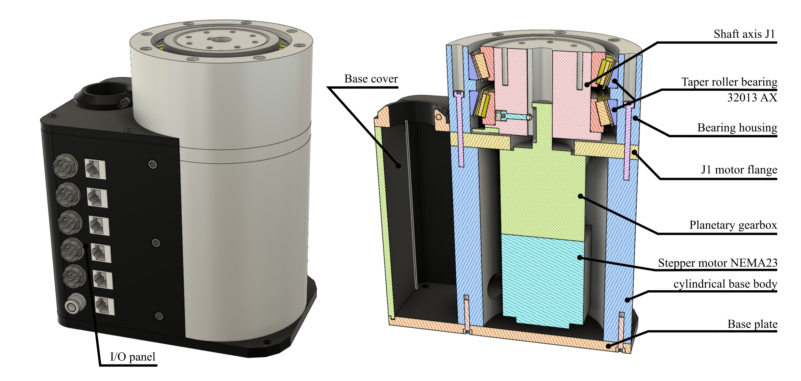
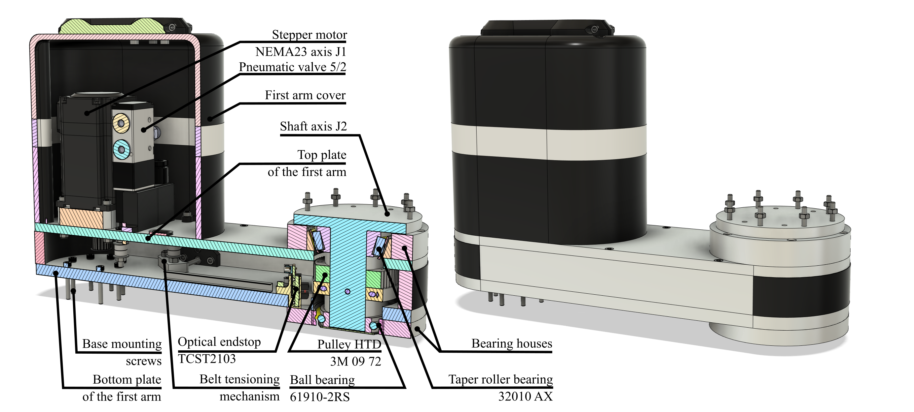
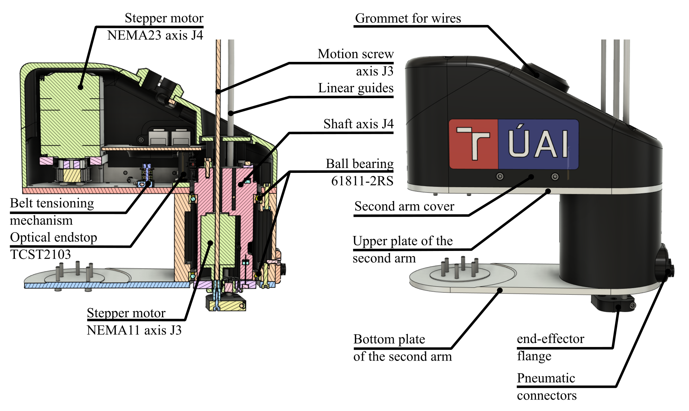
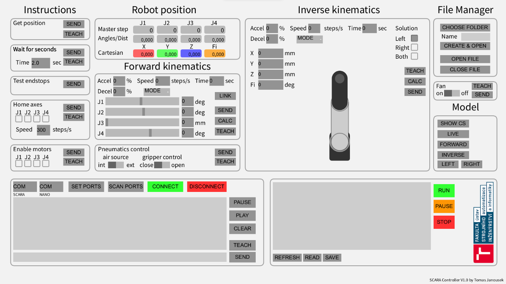
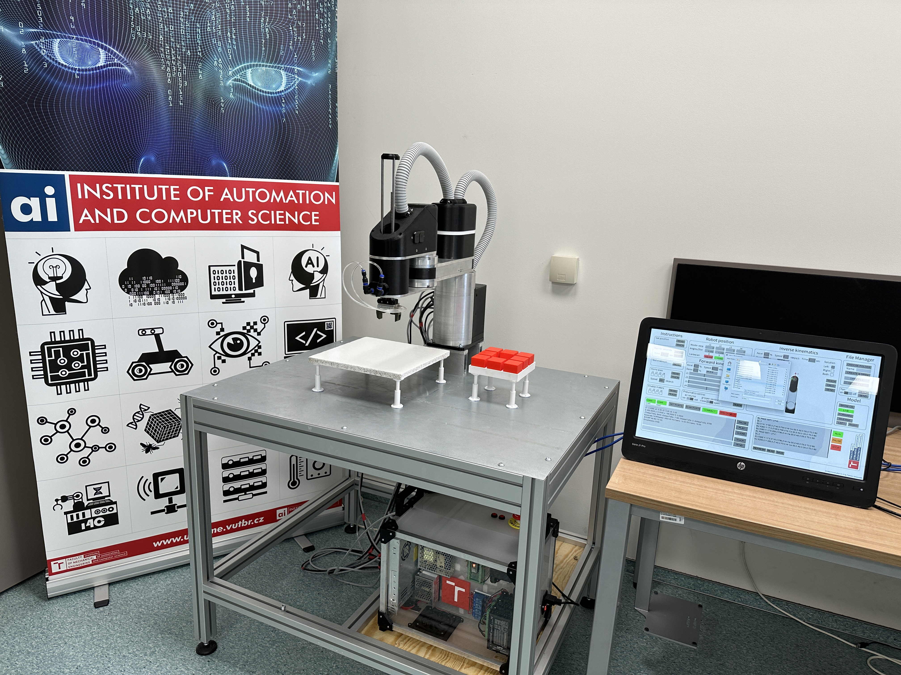

# **AI.SCARA** – The low-cost SCARA robot 
## Abstract
The aim of this project was to design and build a low-cost robot based on the industrial concept SCARA, which meets the requirements in terms of rigidity and repeatability for application in a wide range of manipulation tasks primarily implemented in a university environment. The project includes not only the mechanical design, but also design and implementation of the electrical circuitry, control system, and design of a human-machine graphical interface for basic controland diagnosis of the robotic structure.

## Video demontration
* [AISCARA_Demo](https://youtube.com)
## Repository Index
* [AISCARA_ControlSystem](https://github.com/Katzoun/AI_SCARA/tree/main/AISCARA_ControlSystem) - Source codes for AISCARA control system
* [AISCARA_GUI](https://github.com/Katzoun/AI_SCARA/tree/main/AISCARA_GUI) - Source codes for AISCARA user interface
* [docs](https://github.com/Katzoun/AI_SCARA/tree/main/docs) - Misc documentation files 
* [parts](https://github.com/Katzoun/AI_SCARA/tree/main/parts) - stl files of all components (with list of all parts)

## Mechanical design
The mechanical structure of the robot consists of aluminium parts combined with 3D printed parts. The combination of 3D printing and metal machining provides good rigidity and a reasonable price. In addition, all metal components are designed to be manufactured on conventional machines (mill and lathe) without numerical control. The mechanical design also includes the design of the electrical control cabinet. All parts of the robot were designed in Fusion 360.

The robot design consists of three key units - **the stationary base, the first arm and the second arm.** 

## Electrical design
Stepper motors with encoders were chosen to drive the robot. The main advantage of these motors is their very low purchase price compared to equally powerful servo drives. By controlling stepper motors in a closed loop, better dynamic characteristics can be achieved compared to open-loop stepper motors. Another indisputable advantage of closed-loop control is the possibility of position correction in case of overload. Reference position detection is provided by optical limit switches (TCST2103).

**List of used stepper motors** 
* J1 - NEMA23 [23HS22-2804-ME1K ](https://www.omc-stepperonline.com/nema-23-closed-loop-stepper-motor-1-2nm-166-7oz-in-with-magnetic-encoder-1000ppr-4000cpr-23hs22-2804-me1k) with precision planetary gearbox VRL-070C
* J2 - NEMA23 [1-CL57T-S20-V41 ](https://www.omc-stepperonline.com/ts-series-2-0-nm-283-28oz-in-1-axis-closed-loop-stepper-cnc-kit-nema-23-motor-driver-1-cl57t-s20-v41?search=1-CL57T-S20-V41)
* J3 - NEMA11 [11N18S0754GD-250RS ](https://www.omc-stepperonline.com/nema-11-non-captive-46mm-stack-0-75a-lead-2-54mm-0-1-length-250mm-11n18s0754gd-250rs?search=11N18S0754GD-250RS)
* J4 - NEMA23 [1-CL57T-S12-V41 ](https://www.omc-stepperonline.com/ts-series-1-2-nm-170oz-in-1-axis-closed-loop-stepper-cnc-kit-nema-23-motor-driver-1-cl57t-s12-v41?search=1-CL57T-S12-V41)

The robot controller (shown below) brings together all the electronic components necessary for the proper functioning of the AI.SCARA robot - i.e. stepper motor controllers, microcontrollers that run the control system, power supplies and many others. Power is provided by three DC power supplies - LRS-350-36 (CL57 stepper drivers), LRS-100-12 (pneumatic equipment, DM320T driver, internal air compressors etc.) and RS-25-5 (MCUs).

There are two microcontrollers in the SCARA robot controller. The main MCU is the Teensy 4.1, which performs all the kinematic calculations for the robot's movements.
The reason for choosing the Teensy 4.1 microcontroller for robot motion control was mainly due to its architecture, which is compatible with user-friendly Arduino microcontrollers. The control of the robot peripherals is provided by Arduino Nano. 

## Software

The control software is a key component of the robotic arm. The proposed system simultaneously performs the control and precise synchronization of all four axes of the robot, analytically solves kinematic calculations for maximum computational efficiency, controls the current position of the axes and, last but not least, controls the robot peripherals. 
**The control software running in the robot controller consists of two parts:**

* [AISCARA teensy board](https://github.com/Katzoun/AI_SCARA/tree/main/AISCARA_ControlSystem/AISCARA%20teensy%20board)
* [AISCARA nano board](https://github.com/Katzoun/AI_SCARA/tree/main/AISCARA_ControlSystem/AISCARA%20nano%20board)

For easy interaction with the robot, a user-friendly graphical interface has been created that allows, among other things, simple diagnostics and programming of the robot's movements.

In the lower left corner there is a console where error messages and other information concerning the controller operation are displayed. Below the console there is a command line for manual instruction input. Manual input is particularly useful when testing additional programmed functionalities that are not represented graphically in the interface. To visually check the robot's position, the interface also includes a dynamic 2D model that can operate in three modes. In Live mode, the model displays the position in which the robot is currently physically located. The remaining modes (Forward and Inverse) are simulation modes and are used to visually represent the forward and inverse kinematics solutions. 

Within the proposed interface, the SCARA robot can also be easily programmed in addition to those already mentioned. For most of the instructions, there is a "Teach" button which saves the instruction into the program memory. The entire program is then displayed in a text box to the right of the console. For working with program files, there is a simple file manager in the GUI. Through it you can open already created programs or create completely new ones.

### Establishing communication with the AI.SCARA robot controller
For successful communication between the personal computer and the controller it is first necessary to connect these units via the USB interface. The "scan ports" button is intended to make it easier to find the ports to which the controller is connected. After pressing the "scan ports" button, the console lists the currently used ports of the personal computer. The user interface cannot yet automatically detect which of these ports the controller is on, so the user must manually enter the port names in the appropriate fields. The process of establishing a connection can be initiated with the "connect" button. The connection process is shown in the figure below.

## Result
After successful assembly and debugging, the designed robotic structure was subjected to a series of tests aimed at verifying the basic "metrological" characteristics of the robot. The measurements performed were divided into three main categories - repeatability tests, stiffness tests and complex tests, which are a combination of the previous two. The repeatability of the robot was estimated to be within a few tenths of a millimetre based on the tests performed. 
Again, it should be noted that the measurements made provide only a very basic idea of the metrological characteristics of the proposed solution. The measurement results are influenced not only by the mechanical design but also by the motion control of the robot. A more precise set of validation tests, including a more advanced statistic evaluation, could be addressed in future work. The table below shows the basic technical parameters of the proposed robot.

| Parameter | Value |
| ------ | ------ |
| Horizontal reach (X-Y)  | 400 mm  |
| Vertical reach (Z)      | 170 mm  |
| Payload                 | 1 kg    |
| Repeatability           | tenths of millimetre |
| Max. speed J1           | 120 °/s |
| Max. speed J2           | 120 °/s |
| Max. speed J3           | 80 mm/s |
| Max. speed J4           | 160 °/s |
| Axis range J1           | -116° to +125° |
| Axis range J2           | -129° to +120° |
| Axis range J3           | 170 mm |
| Axis range J4           | -190° to +120° |
| Robot weight         | 17 kg |
| Controller weight          | 8 kg |
| Build price | approx. 1500 €| 

## Contact info
For more information and details about this project please contact me on
tomas.janousek02@gmail.com