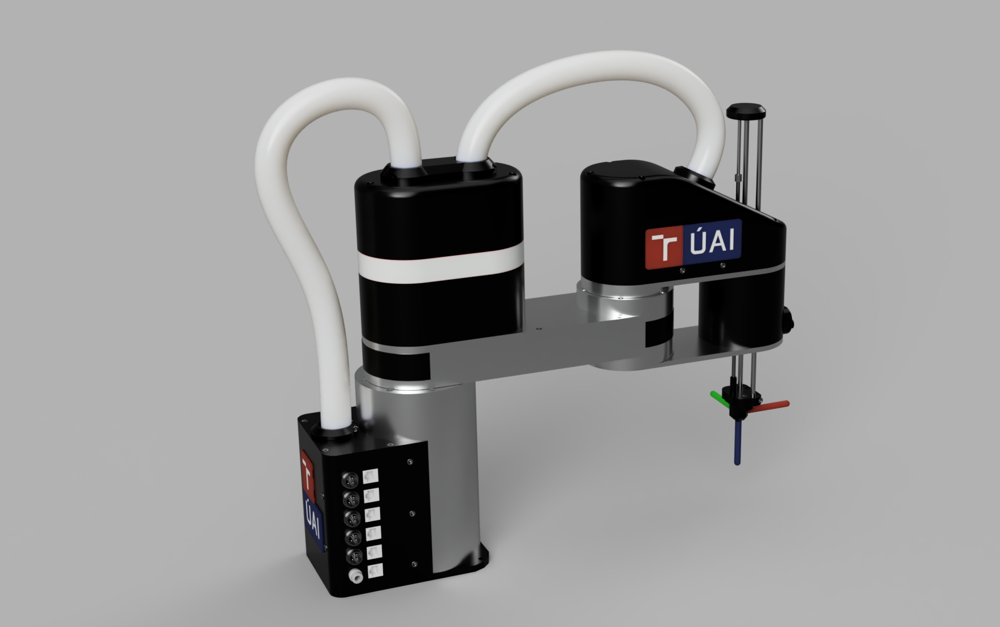

# **AI.SCARA** – Open-source low-cost SCARA robot 
## Abstract
The aim of this project was to design and build a low-cost robot based on the industrial concept SCARA, which meets the requirements in terms of rigidity and repeatability for application in a wide range of manipulation tasks primarily implemented in a university environment. The project includes not only the mechanical design, but also design and implementation of the electrical circuitry, control system, and design of a human-machine graphical interface for basic controland diagnosis of the robotic structure.

## Repository Index
* [AISCARA_ControlSystem](https://github.com/Katzoun/AI_SCARA/tree/main/AISCARA_ControlSystem) - Source codes for AISCARA control system
* [AISCARA_GUI](https://github.com/Katzoun/AI_SCARA/tree/main/AISCARA_GUI) - Source codes for AISCARA user interface
* [docs](https://github.com/Katzoun/AI_SCARA/tree/main/docs) - misc documentation files 
* [stl]() - stl files of 3D printed parts

## Mechanical design

## Electrical diagrams

